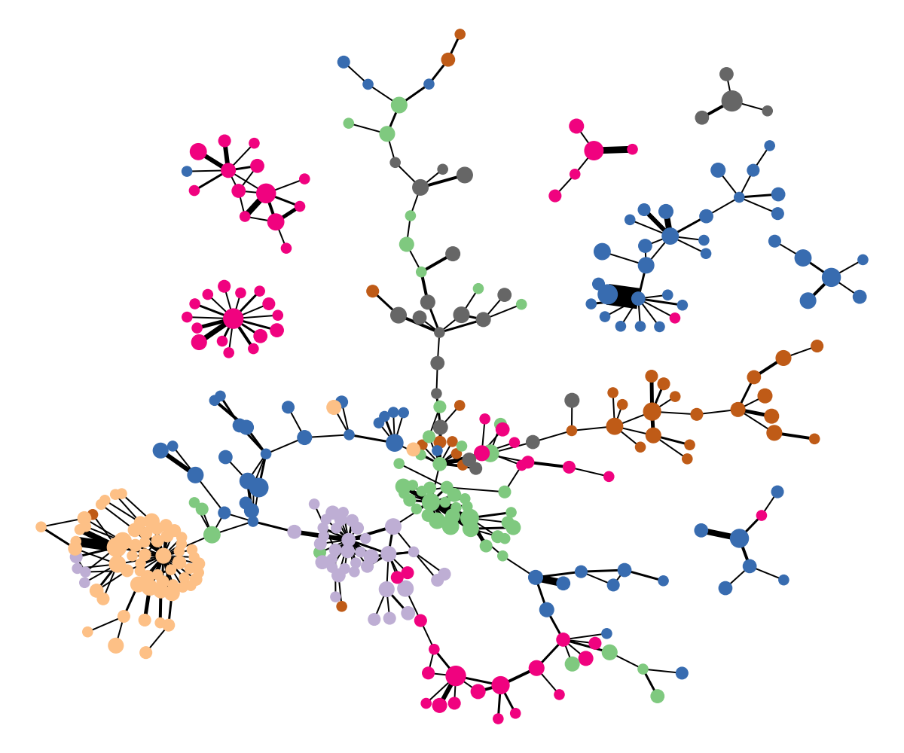

# Deep Graph Mapper
Official code for the paper [**Deep Graph Mapper: Seeing Graphs through the Neural Lens**](https://arxiv.org/abs/2002.03864) ([Cristian Bodnar*](https://crisbodnar.github.io/), [Cătălina Cangea*](https://catalinacangea.netlify.com/), [Pietro Liò](https://www.cl.cam.ac.uk/~pl219/)).


A cartoon illustration of The Deep Graph Mapper (DGM) algorithm where, for simplicity, the GNN approximates a `height' function 
over the nodes in the plane of the diagram. The input graph (a) is passed through a Graph Neural Network (GNN), 
which maps the vertices of the graph to a real number (the height) (b). 
Given a cover of the image of the GNN (c), the refined pull back cover is computed (d--e). 
The 1-skeleton of the nerve of the pull back cover provides the visual summary of the graph (f). 
The diagram is inspired from [Hajij et al. (2018)](https://arxiv.org/abs/1804.11242).

## Getting started
We used `python 3.5` for this project. To setup the virtual environment and necessary packages, please run the following commands:
```
$ virtualenv -p python3.5 dgm
$ source dgm/bin/activate
$ pip3 install torch==1.4.0 torchvision==0.5.0
$ pip3 install -r requirements.txt
```

## Visualisations

Example visualisation for the synthetic spammer graph and Cora are provided and can be run 
with ```./plot_all.sh``` from the root directory of the project. The visualisations are saved 
in the ```plots``` directory. For most purposes, we recommend to use Structural Deep Graph Mapper (SDGM),
described in Appendix B of the paper. 

DGM can be used as follows

```
from dgm.dgm import DGM

dgm = DGM(num_intervals=10, overlap=0.1)
out_graph, res = dgm.fit_transform(graph, node_embeddings)

```

An example SDGM visualisation of Cora with Deep Graph Infomax lens can be seen below. Each colour represents a 
different class in the citation network. 




## Running pooling experiments
You can reproduce our results by running the `run.sh` script with the following arguments:
1. index of the GPU to run the experiment on
2. dataset name (DD, PROTEINS, COLLAB, REDDIT-BINARY)
3. model to validate (mpr, diffpool, mincut)
4. dataset fold to run (1-10 or 0 for 10-fold cross-validation)

For example, the command `./run.sh 0 PROTEINS mpr 0` will perform 10-fold cross-validation for our proposed MPR pooling model on GPU 0 for the Proteins dataset.


## Citation
Please cite us if you use DGM and/or MPR in your work:
```
@article{bodnar2020deep,
  title={Deep Graph Mapper: Seeing Graphs through the Neural Lens},
  author={Bodnar, Cristian and Cangea, C{\u{a}}t{\u{a}}lina and Li{\`o}, Pietro},
  journal={arXiv preprint arXiv:2002.03864},
  year={2020}
}
```
